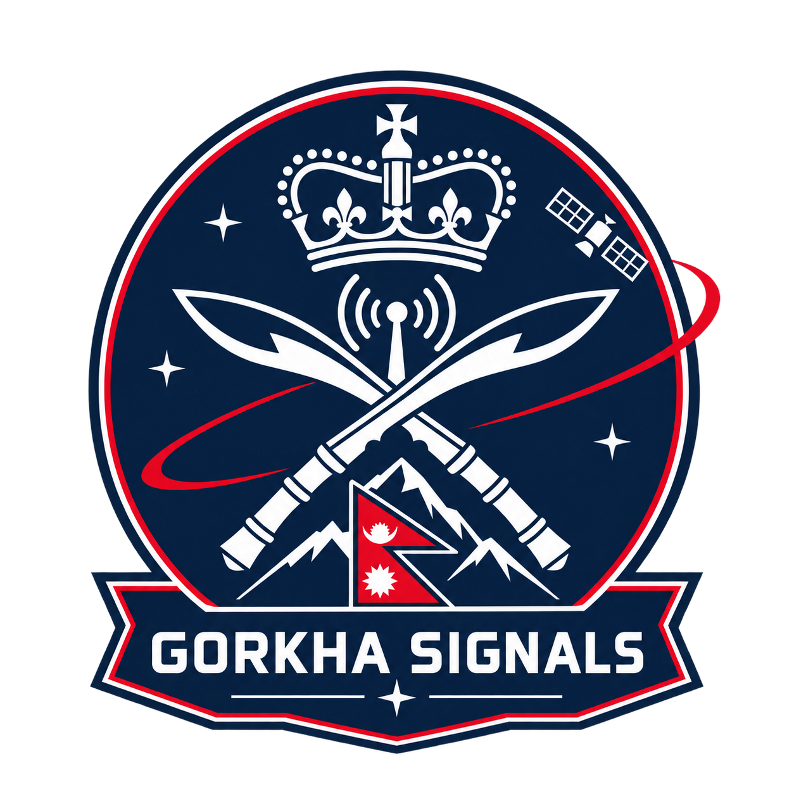

<div align="center">
  

  # Gorkha Signals

  ### NASA Space Apps Challenge 2026
  **Be An Earth System Trend Detective!**

  *Turning NASA Earth-system data into understandable evidence about how our planet is changing.*

  [](https://www.spaceappschallenge.org/)
  [](https://www.spaceappschallenge.org/2026/challenges/be-an-earth-system-trend-detective/)
  [](#project-status)
</div>

---

## Mission

**Gorkha Signals** is an Earth-system investigation platform built for the **2026 NASA Space Apps Challenge**. It is designed to help people explore NASA Earth-observation and Earth-system datasets, identify meaningful trends and anomalies, compare environmental variables, and understand the evidence behind those changes.

Instead of presenting scientific data as isolated maps or charts, Gorkha Signals aims to turn the data into an **investigation workflow**:

> **Observe → Detect → Compare → Investigate → Explain**

The project is being developed around NASA's 2026 challenge **“Be An Earth System Trend Detective!”**, which asks participants to work with Earth-system data and investigate patterns across weather, precipitation, land-surface, atmospheric, and related observations.

---
## Dashboard protoype
<div align="center">
  

## The Challenge

Earth is a connected system. Changes in one part of the system can occur alongside changes in other variables, across different places and times.

The challenge is not simply to display more data. The challenge is to make large-scale Earth-system observations **discoverable, comparable, and understandable**.

Gorkha Signals focuses on questions such as:

- Where are significant environmental trends appearing?
- When did a trend or anomaly become noticeable?
- How does a selected region compare across different time periods?
- Which variables changed at the same time?
- What evidence supports an observed relationship?
- How can complex scientific datasets be communicated clearly to a non-specialist user?

> **Important:** Gorkha Signals distinguishes observed relationships from causation. A correlation or temporal coincidence is presented as evidence for investigation, not automatically as proof that one variable caused another.

---

## Our Approach

Gorkha Signals combines NASA data processing, statistical analysis, interactive visualization, and an investigation-oriented user experience.

### 1. Select
Choose a geographic region and a period of interest.

### 2. Observe
Load relevant NASA Earth-system observations and derived datasets.

### 3. Detect
Calculate trends, anomalies, changes, and other signals in the selected data.

### 4. Compare
Place multiple variables or time periods side by side to investigate relationships.

### 5. Explain
Present the supporting evidence through maps, timelines, graphs, and concise analytical summaries.

### 6. Investigate further
Allow the user to move from an initial signal to the underlying data rather than treating an automated summary as the final scientific conclusion.

---

## Core Experience

The planned interface follows a **mission-control / scientific investigation** model rather than a conventional dashboard.

```text
                         NASA / Partner Open Data
                                  │
                                  ▼
                         Data Ingestion Layer
                                  │
                                  ▼
                      Processing & Normalization
                                  │
                                  ▼
                    Trend / Anomaly Detection
                                  │
                    ┌─────────────┼─────────────┐
                    ▼             ▼             ▼
                 Maps          Timelines      Charts
                    │             │             │
                    └─────────────┼─────────────┘
                                  ▼
                       Investigation Workspace
                                  │
                                  ▼
                       Evidence-based Summary
```

The intended experience is to make the user feel less like they are browsing a dataset and more like they are **investigating a signal from the Earth system**.

---

## Planned Features

### Earth-system Explorer
- Region and time-period selection
- Interactive geographic visualization
- NASA dataset selection
- Layered environmental observations

### Trend Detection
- Long-term trend analysis
- Short-term anomaly detection
- Change-point or significant-change exploration where appropriate
- Historical comparison

### Variable Comparison
- Compare environmental variables over the same region and period
- Overlay or align time series
- Highlight simultaneous changes
- Provide supporting evidence for further investigation

### Evidence View
- Maps
- Time-series graphs
- Statistical summaries
- Timeline-based investigation
- Source/data attribution

### Investigation Reports
The project is designed to eventually generate a concise investigation summary containing:

- **What was observed**
- **Where it occurred**
- **When it occurred**
- **Which variables were involved**
- **What the data supports**
- **What remains uncertain**

This structure is intended to keep the application evidence-driven rather than presenting unsupported conclusions.

---

## NASA Data & Scientific Foundation

NASA Space Apps is built around the use of open NASA and Space Agency Partner data. For this project, the data layer is expected to draw from appropriate NASA Earth-observation and Earth-system resources, depending on the final implementation and dataset availability.

Potential data categories include:

| Category | Example use in Gorkha Signals |
|---|---|
| Weather | Detect changes and unusual patterns over time |
| Precipitation | Explore rainfall trends and anomalies |
| Land surface | Investigate environmental and land-surface changes |
| Atmosphere | Compare atmospheric observations with other Earth-system variables |
| Satellite observations | Provide spatial context for detected signals |

The final implementation will document the exact datasets, variables, spatial/temporal resolution, processing methods, and source links used by the application.

---

## Technical Architecture

```text
┌───────────────────────────────────────────────────────────────┐
│                         GORKHA SIGNALS                        │
├───────────────────────────────────────────────────────────────┤
│                                                               │
│  Frontend                                                     │
│  ┌─────────────────────────────────────────────────────────┐  │
│  │ React / Next.js                                         │  │
│  │ Maps • Charts • Investigation UI • Data Explorer       │  │
│  └──────────────────────────┬──────────────────────────────┘  │
│                             │                                 │
│                             ▼                                 │
│  Analysis Layer                                                │
│  ┌─────────────────────────────────────────────────────────┐  │
│  │ Python                                                  │  │
│  │ Data processing • Statistics • Trend detection         │  │
│  │ Anomaly detection • Scientific transformations        │  │
│  └──────────────────────────┬──────────────────────────────┘  │
│                             │                                 │
│                             ▼                                 │
│  Data Layer                                                    │
│  ┌─────────────────────────────────────────────────────────┐  │
│  │ NASA / Space Agency Partner open datasets              │  │
│  │ APIs • Downloads • Processed scientific data           │  │
│  └─────────────────────────────────────────────────────────┘  │
│                                                               │
└───────────────────────────────────────────────────────────────┘
```

### Planned technology stack

| Layer | Technology | Purpose |
|---|---|---|
| Frontend | **TypeScript / React / Next.js** | Interactive scientific interface |
| Analysis | **Python** | Data processing and statistical analysis |
| Visualization | **Maps + interactive charts** | Spatial and temporal investigation |
| Data | **NASA open data / APIs / downloads** | Scientific source data |
| Development | **Git + GitHub** | Version control and collaboration |

The exact libraries and services may evolve as the prototype is implemented.

---

## Why This Project

NASA describes Space Apps as an opportunity for people around the world to use NASA and Space Agency Partner open data to create solutions to real-world challenges on Earth and in space. The 2026 event theme is **“The Next Frontier.”**

Gorkha Signals follows that philosophy by focusing on a practical question:

> **How can complex Earth-system observations become signals that people can actually investigate?**

The goal is not to replace scientists or make unsupported predictions. It is to create an accessible bridge between **large scientific datasets and human investigation**.

---

## Design Principles

### Evidence first
Every important observation should be traceable to the underlying data and documented processing method.

### Relationships ≠ causation
The interface should clearly distinguish correlation, temporal association, and demonstrated causal evidence.

### Human-in-the-loop
Automated analysis should help users discover signals, while keeping investigation and interpretation transparent.

### Accessible science
A user should be able to understand the significance of a visualization without needing to be an Earth-system scientist.

### Reproducible analysis
Where practical, processing steps and dataset metadata should be documented so results can be reproduced or inspected.

### NASA data at the center
The project should demonstrate meaningful use of NASA data rather than using NASA only as a theme or visual reference.

---

## Project Status

**Current stage: Prototype / In Development**

### Roadmap

- [x] Select the official NASA Space Apps 2026 challenge
- [x] Define the Earth-system investigation concept
- [x] Establish the product direction and architecture
- [ ] Finalize datasets and variables
- [ ] Implement data ingestion
- [ ] Implement trend and anomaly analysis
- [ ] Build interactive investigation interface
- [ ] Add evidence visualization
- [ ] Validate results against source data
- [ ] Prepare demonstration workflow
- [ ] Complete NASA Space Apps submission materials

---

## Repository Structure

The repository will evolve as the prototype is built. The intended organization is approximately:

```text
.
├── assets/
│   └── Gorkha.Signals.png
├── frontend/
├── analysis/
├── data/
├── docs/
├── notebooks/
├── tests/
└── README.md
```

Large datasets should not be committed directly unless their licensing, size, and repository requirements make that appropriate. Dataset acquisition and preprocessing instructions will be documented separately.

---

## Team

### Gorkha Signals

A three-member student team from Nepal building a NASA-data-driven Earth-system investigation prototype.

| Member | Focus |
|---|---|
| **Ayush** | AI/software, Raspberry Pi & robotics, web/product integration |
| **Supreme Ojha** | C++, Python, websites and applications |
| **Yugansu Rijal** | Hardware/maker systems and software |

The team combines software development, data/AI experimentation, web development, and hands-on hardware experience.

---

## Research & References

The project direction is informed by the official NASA Space Apps Challenge resources and NASA's public software/data ecosystem.

- [NASA Space Apps Challenge](https://www.spaceappschallenge.org/)
- [2026 — Be An Earth System Trend Detective!](https://www.spaceappschallenge.org/2026/challenges/be-an-earth-system-trend-detective/)
- [NASA Space Apps GitHub](https://github.com/nasa/spaceapps)
- [NASA GitHub Organization](https://github.com/nasa)
- [NASA API Documentation](https://github.com/nasa/api-docs)

NASA's official Space Apps GitHub repository describes the event as a hackathon where coders, scientists, designers, storytellers, makers, technologists, and innovators use open NASA and Space Agency Partner data to address challenges on Earth and in space.

---

## Disclaimer

**Gorkha Signals is an independent student project created for the NASA Space Apps Challenge. It is not an official NASA product, application, or endorsement.**

NASA datasets and services remain subject to their respective terms, attribution requirements, and data-use policies. The project will identify the sources and processing methods used for its analyses.

---

<div align="center">

### Built in Nepal 🇳🇵 for NASA Space Apps 2026 🚀

**Observe the signal. Investigate the evidence. Understand our changing Earth.**

</div>
